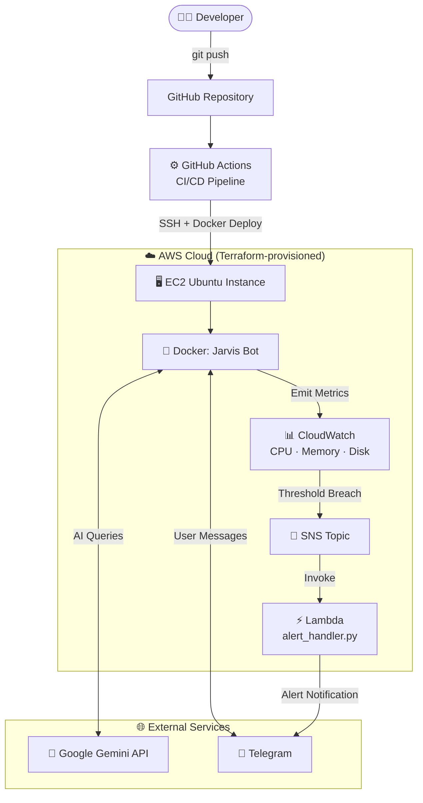
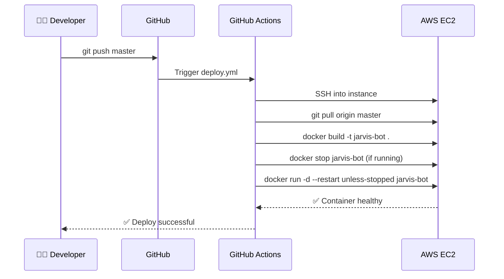
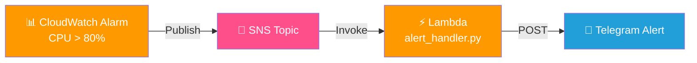

<div align="center">

# 🤖 Jarvis DevOps Bot

### An AI-powered Telegram bot with end-to-end DevOps automation

[](https://python.org)
[](https://docker.com)
[](https://aws.amazon.com)
[](https://terraform.io)
[](https://github.com/features/actions)
[](LICENSE)
[](https://github.com/Sahilx987/jarvis-devops-bot/actions/workflows/deploy.yml)

[Features](#-features) · [Architecture](#️-architecture) · [Quick Start](#-quick-start) · [CI/CD](#-cicd-pipeline) · [Monitoring](#-monitoring--alerting) · [Roadmap](#-roadmap)

</div>

---

## 📌 What is this project?

**Jarvis DevOps Bot** is a full-lifecycle DevOps portfolio project. It is a real AI chatbot deployed on AWS — but more importantly, it demonstrates every stage of modern cloud engineering:

| Stage | What it covers |
|---|---|
| 💻 Development | Python bot with Google Gemini AI integration |
| 🐳 Containerization | Dockerized app with health checks |
| 🏗️ Infrastructure | EC2, IAM, and Security Groups via Terraform |
| 🔄 Automation | GitHub Actions CI/CD — zero-touch deploys on every push |
| 📊 Observability | CloudWatch alarms → SNS → Lambda → Telegram alerts |

> **Every `git push` to `master` automatically rebuilds and redeploys the container on AWS EC2 — no manual SSH needed.**

---

## ✨ Features

- 🧠 **AI Chatbot** — Conversational assistant powered by Google Gemini, accessible via Telegram
- 🐳 **Dockerized** — Consistent, portable runtime with `HEALTHCHECK` support
- 🔄 **Zero-touch CI/CD** — GitHub Actions builds and restarts the container on every commit
- 🏗️ **Infrastructure as Code** — Full AWS environment provisioned and version-controlled via Terraform
- 📊 **Cloud Monitoring** — CPU, memory, and disk metrics tracked in CloudWatch
- 🚨 **Real-time Alerts** — SNS → Lambda → Telegram pipeline sends instant alarm notifications
- 🔐 **Security-first** — Secrets in GitHub Actions, key-based SSH, least-privilege IAM

---

## 🏗️ Architecture



---

## 📁 Project Structure

```
jarvis-devops-bot/
│
├── .github/
│   └── workflows/
│       └── deploy.yml          # CI/CD: build → stop → redeploy
│
├── bot.py                      # Entry point — starts the Telegram bot
├── config.py                   # Loads env vars / secrets
│
├── handlers/
│   └── ai_chat.py              # Routes Telegram messages to Gemini
│
├── services/
│   └── gemini_service.py       # Google Gemini API client
│
├── lambda/
│   └── alert_handler.py        # Parses SNS payload → sends Telegram alert
│
├── terraform/
│   ├── main.tf                 # EC2, SG, IAM, CloudWatch alarms
│   ├── variables.tf
│   └── outputs.tf
│
├── Dockerfile                  # Multi-stage build, HEALTHCHECK included
├── .dockerignore
├── .env.example                # Template for local development
├── requirements.txt
└── README.md
```

---

## 🚀 Quick Start

### Prerequisites

- AWS account + CLI configured
- [Terraform](https://developer.hashicorp.com/terraform/downloads) installed
- [Docker](https://docs.docker.com/get-docker/) installed
- Telegram bot token from [@BotFather](https://t.me/botfather)
- [Google Gemini API key](https://aistudio.google.com/app/apikey)

---

### Option A — Run Locally

```bash
# 1. Clone the repo
git clone https://github.com/Sahilx987/jarvis-devops-bot.git
cd jarvis-devops-bot

# 2. Create virtual environment
python -m venv venv
source venv/bin/activate        # Linux/Mac
.\venv\Scripts\activate         # Windows

# 3. Install dependencies
pip install -r requirements.txt

# 4. Configure environment
cp .env.example .env
# Edit .env and add your BOT_TOKEN and GEMINI_API_KEY

# 5. Run the bot
python bot.py
```

---

### Option B — Run with Docker

```bash
docker build -t jarvis-bot .

docker run -d \
  --name jarvis-bot \
  --restart unless-stopped \
  -e BOT_TOKEN=your_token \
  -e GEMINI_API_KEY=your_key \
  jarvis-bot

# Check logs
docker logs -f jarvis-bot
```

---

### Option C — Deploy to AWS with Terraform

```bash
cd terraform/

# Initialize providers
terraform init

# Preview changes
terraform plan

# Apply infrastructure
terraform apply
```

**Resources created:**
- EC2 Ubuntu instance (t2.micro or your chosen size)
- Security group (SSH on port 22)
- IAM role with CloudWatch permissions
- CloudWatch alarms for CPU, memory, disk
- SNS topic for alarm notifications

---

## ⚙️ GitHub Actions Secrets

Go to **Settings → Secrets and variables → Actions** in your repo and add:

| Secret | Description |
|---|---|
| `BOT_TOKEN` | Telegram bot token |
| `GEMINI_API_KEY` | Google Gemini API key |
| `EC2_HOST` | Public IP of your EC2 instance |
| `EC2_USER` | SSH user (e.g. `ubuntu`) |
| `EC2_SSH_KEY` | Contents of your `.pem` private key |

---

## 🔄 CI/CD Pipeline

Every push to `master` triggers this workflow automatically:



> All secrets are injected at runtime — nothing is stored in the codebase.

---

## 📊 Monitoring & Alerting



**Example alert message received on Telegram:**

```
🚨 ALARM: High CPU Usage
━━━━━━━━━━━━━━━━━━━━━━━
Instance : jarvis-devops-bot
Metric   : CPUUtilization = 87%
Threshold: > 80% for 5 min
Region   : ap-south-1
Time     : 2026-05-12 18:30 UTC
━━━━━━━━━━━━━━━━━━━━━━━
Action: Check EC2 console immediately
```

---

## 🔐 Security Practices

- ✅ Secrets managed via GitHub Actions Secrets — never in source code
- ✅ `.env`, `.pem` keys, and Terraform state excluded via `.gitignore`
- ✅ SSH key-based authentication only (password auth disabled)
- ✅ EC2 security group restricts inbound traffic to required ports
- ✅ IAM role follows least-privilege principle
- ✅ Docker `HEALTHCHECK` ensures container self-monitors

---

## 🗺️ Roadmap

- [ ] Store secrets in **AWS Secrets Manager** instead of GitHub Secrets
- [ ] Push Docker images to **Amazon ECR** with version tagging
- [ ] Add **automated rollback** if new container fails health check
- [ ] Write unit tests with `pytest` and integrate into CI pipeline
- [ ] Set up **CloudWatch Dashboard** for visual metrics
- [ ] Add `docker-compose.yml` for local multi-service development
- [ ] Implement **conversation history** using DynamoDB

---

## 🤝 Contributing

Contributions are welcome! Please open an issue first to discuss changes.

1. Fork the repo
2. Create a feature branch (`git checkout -b feature/my-feature`)
3. Commit your changes (`git commit -m 'Add some feature'`)
4. Push to the branch (`git push origin feature/my-feature`)
5. Open a Pull Request

---

## 👤 Author

**Sahil Kumar**

[](https://github.com/Sahilx987)
[](https://www.linkedin.com/in/sahil-kumar-cloud/)

---

## 📄 License

MIT License — Copyright (c) 2026 Sahil Kumar

See [LICENSE](LICENSE) for full details.