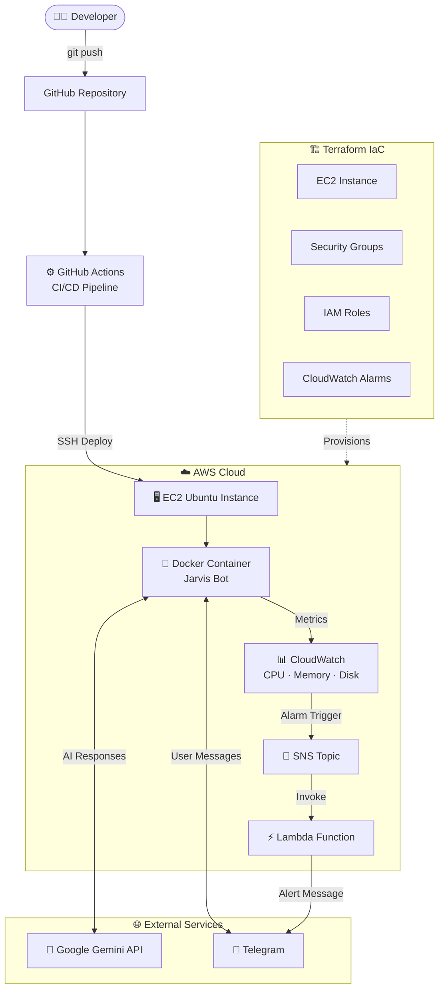
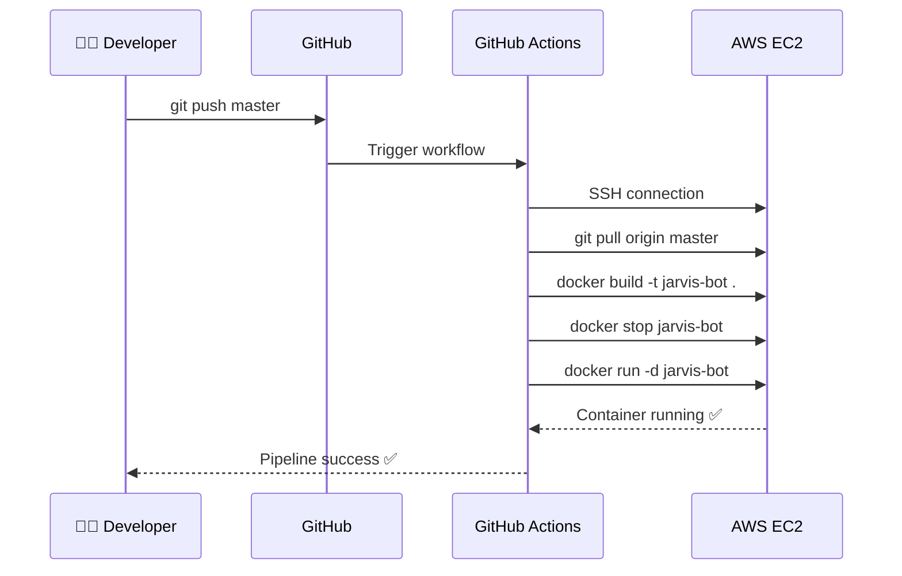
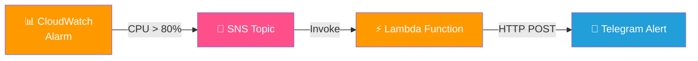

<<<<<<< Updated upstream
# 🤖 Jarvis DevOps Bot

> An AI-powered Telegram bot built with Python and Google Gemini, deployed on AWS EC2 with fully automated CI/CD, Infrastructure as Code, and real-time cloud monitoring.


---

## 📌 Project Overview

**Jarvis DevOps Bot** is a personal DevOps portfolio project that demonstrates real-world cloud engineering practices. It combines an AI-powered Telegram chatbot with automated deployment pipelines, infrastructure provisioning, and cloud-native monitoring.

The project covers the full DevOps lifecycle — from writing code to containerizing it, deploying it automatically to the cloud, and monitoring it with real-time alerts.

**Key highlight:** Every `git push` to the `master` branch automatically rebuilds and redeploys the Docker container on AWS EC2 — no manual SSH required.

---

## 🏗️ Architecture

```
Developer (git push)
        │
        ▼
┌─────────────────────┐
│   GitHub Actions    │  ← CI/CD Pipeline (automated)
│   CI/CD Workflow    │
└────────┬────────────┘
         │ SSH deploy
         ▼
┌─────────────────────┐
│     AWS EC2         │  ← Ubuntu instance (always-on)
│  Ubuntu Instance    │
│  ┌───────────────┐  │
│  │ Docker        │  │  ← Containerized Python bot
│  │ Container     │  │
│  │ (Jarvis Bot)  │  │
│  └───────────────┘  │
└────────┬────────────┘
         │ Metrics
         ▼
┌─────────────────────┐
│  AWS CloudWatch     │  ← CPU, Memory, Disk monitoring
└────────┬────────────┘
         │ Alarm trigger
         ▼
┌─────────────────────┐
│     AWS SNS         │  ← Alert topic
└────────┬────────────┘
         │ Invoke
         ▼
┌─────────────────────┐
│   AWS Lambda        │  ← Serverless alert handler
└────────┬────────────┘
         │ Send message
         ▼
┌─────────────────────┐
│  Telegram Bot       │  ← Real-time alert to phone
│  (Alert Channel)    │
└─────────────────────┘
```

---

## ✨ Features

- **AI Chatbot** — Powered by Google Gemini API; responds to natural language queries via Telegram
- **Dockerized Deployment** — Application runs inside a Docker container for consistency across environments
- **Automated CI/CD** — GitHub Actions pipeline automatically SSHes into EC2, rebuilds, and restarts the container on every push
- **Infrastructure as Code** — EC2 instance, security groups, and IAM roles provisioned using Terraform
- **CloudWatch Monitoring** — EC2 metrics (CPU, memory, disk) monitored with threshold-based alarms
- **Real-time Alerting** — SNS triggers a Lambda function which sends instant Telegram notifications on any alarm
- **SSH Deployment Automation** — No manual server access needed post-setup

---

## 🛠️ Tech Stack

| Category | Technology |
|---|---|
| Language | Python 3.11 |
| Bot Framework | python-telegram-bot |
| AI Model | Google Gemini API |
| Containerization | Docker |
| CI/CD | GitHub Actions |
| Cloud Provider | AWS (EC2, Lambda, SNS, CloudWatch) |
| Infrastructure as Code | Terraform |
| OS | Ubuntu (EC2) |
| Version Control | Git + GitHub |

---

## 📁 Repository Structure

```
jarvis-devops-bot/
├── .github/
│   └── workflows/
│       └── deploy.yml          # GitHub Actions CI/CD pipeline
├── handlers/
│   └── message_handler.py      # Telegram message handling logic
├── services/
│   └── gemini_service.py       # Google Gemini API integration
├── terraform/                  # (recommended) IaC files
│   ├── main.tf
│   ├── variables.tf
│   └── outputs.tf
├── bot.py                      # Main bot entry point
├── config.py                   # Configuration loader
├── requirements.txt            # Python dependencies
├── Dockerfile                  # Container definition
├── .dockerignore               # Docker build exclusions
├── .gitignore                  # Git exclusions
└── README.md
```

---

## ⚙️ Setup Instructions

### Prerequisites

- AWS account with EC2 access
- Telegram Bot Token (from [@BotFather](https://t.me/botfather))
- Google Gemini API Key
- Terraform installed locally
- Docker installed on EC2

### 1. Clone the Repository

```bash
git clone https://github.com/Sahilx987/jarvis-devops-bot.git
cd jarvis-devops-bot
```

### 2. Configure Environment Variables

Never hardcode secrets. Set these as GitHub Actions Secrets:

| Secret Name | Description |
|---|---|
| `TELEGRAM_BOT_TOKEN` | Your Telegram bot token |
| `GEMINI_API_KEY` | Google Gemini API key |
| `EC2_HOST` | Public IP of your EC2 instance |
| `EC2_USER` | EC2 SSH username (e.g. `ubuntu`) |
| `EC2_SSH_KEY` | Private SSH key (PEM file contents) |

### 3. Provision Infrastructure with Terraform

```bash
cd terraform/
terraform init
terraform plan
terraform apply
```

This creates:
- EC2 instance (t2.micro or t3.micro)
- Security group (port 22 for SSH)
- IAM role for CloudWatch

### 4. Run Locally (for testing)

```bash
# Create virtual environment
python -m venv venv
source venv/bin/activate        # Linux/Mac
.\venv\Scripts\activate         # Windows

# Install dependencies
pip install -r requirements.txt

# Set environment variables
export TELEGRAM_BOT_TOKEN=your_token
export GEMINI_API_KEY=your_key

# Run bot
python bot.py
```

### 5. Run with Docker

```bash
docker build -t jarvis-bot .

docker run -d \
  -e TELEGRAM_BOT_TOKEN=your_token \
  -e GEMINI_API_KEY=your_key \
  --name jarvis-bot \
  jarvis-bot
```

---

## 🔄 CI/CD Pipeline

**File:** `.github/workflows/deploy.yml`

The pipeline triggers automatically on every push to `master`:

```
Push to master
      │
      ▼
GitHub Actions Runner
      │
      ├── SSH into EC2
      ├── Pull latest code (git pull)
      ├── Rebuild Docker image
      ├── Stop old container
      └── Start new container
```

**Key steps in the workflow:**

```yaml
- name: Deploy to EC2
  uses: appleboy/ssh-action@master
  with:
    host: ${{ secrets.EC2_HOST }}
    username: ${{ secrets.EC2_USER }}
    key: ${{ secrets.EC2_SSH_KEY }}
    script: |
      cd jarvis-devops-bot
      git pull origin master
      docker build -t jarvis-bot .
      docker stop jarvis-bot || true
      docker rm jarvis-bot || true
      docker run -d --name jarvis-bot \
        -e TELEGRAM_BOT_TOKEN=${{ secrets.TELEGRAM_BOT_TOKEN }} \
        -e GEMINI_API_KEY=${{ secrets.GEMINI_API_KEY }} \
        jarvis-bot
```

> **Security note:** All secrets are stored in GitHub Actions Secrets — never in code.

---

## 🏗️ Terraform Infrastructure

**Provisioned resources:**

- **EC2 Instance** — Ubuntu server running the Docker container
- **Security Group** — Controls inbound/outbound traffic (SSH only)
- **IAM Role** — Grants EC2 permission to publish metrics to CloudWatch
- **CloudWatch Alarms** — CPU utilization threshold alerts

```hcl
# Example: EC2 instance resource
resource "aws_instance" "jarvis_bot" {
  ami           = var.ami_id
  instance_type = "t2.micro"
  key_name      = var.key_pair_name

  tags = {
    Name    = "jarvis-devops-bot"
    Project = "jarvis-bot"
  }
}
```

---

## 📊 Monitoring & Alerting

**CloudWatch → SNS → Lambda → Telegram**

1. **CloudWatch** monitors EC2 metrics: CPU utilization, memory (via CloudWatch Agent), disk usage
2. **Alarm triggers** when a metric crosses the defined threshold (e.g. CPU > 80%)
3. **SNS topic** receives the alarm notification
4. **Lambda function** (Python) is subscribed to the SNS topic and parses the alarm payload
5. **Telegram message** is sent to a designated chat with the alert details

**Example Lambda alert message:**
```
🚨 ALARM: High CPU Usage
Instance: jarvis-devops-bot (i-0abc123)
Metric: CPUUtilization = 87%
Threshold: > 80% for 5 minutes
Time: 2026-05-09 18:30 UTC
```

---

## 🔐 Security Practices

- All secrets stored in GitHub Actions Secrets — never in source code
- `.env` files excluded via `.gitignore`
- SSH key-based authentication only (no password login)
- EC2 security group restricts access to required ports only
- IAM role follows least-privilege principle

---

## 📸 Screenshots

> _Add screenshots here after deployment_

| Feature | Screenshot |
|---|---|
| Bot responding in Telegram | _(add screenshot)_ |
| GitHub Actions pipeline run | _(add screenshot)_ |
| CloudWatch alarm dashboard | _(add screenshot)_ |
| Telegram alert notification | _(add screenshot)_ |

---

## 🚀 Future Improvements

- [ ] Add `docker-compose.yml` for multi-container setup
- [ ] Implement health check endpoint for the bot
- [ ] Use AWS Secrets Manager instead of GitHub Secrets for production
- [ ] Add automated rollback on deployment failure
- [ ] Set up CloudWatch dashboard for visual monitoring
- [ ] Add unit tests with `pytest` and integrate into CI pipeline
- [ ] Use ECR (Elastic Container Registry) to store Docker images
- [ ] Implement blue-green deployment strategy

---

## 👤 Author

**Sahil**
- GitHub: [@Sahilx987](https://github.com/Sahilx987)
- LinkedIn: _(add your LinkedIn URL)_

---

## 📄 License

This project is for portfolio and learning purposes.
=======
# 🤖 Jarvis DevOps Bot

> An AI-powered Telegram bot built with Python and Google Gemini, deployed on AWS EC2 with fully automated CI/CD, Infrastructure as Code, and real-time cloud monitoring.


---

## 📌 Project Overview

**Jarvis DevOps Bot** is a personal DevOps portfolio project that demonstrates real-world cloud engineering practices. It combines an AI-powered Telegram chatbot with automated deployment pipelines, infrastructure provisioning, and cloud-native monitoring.

The project covers the full DevOps lifecycle — from writing code to containerizing it, deploying it automatically to the cloud, and monitoring it with real-time alerts.

**Key highlight:** Every `git push` to the `master` branch automatically rebuilds and redeploys the Docker container on AWS EC2 — no manual SSH required.

---

## 🏗️ Architecture
Developer (git push)
│
▼
┌─────────────────────┐
│   GitHub Actions    │  ← CI/CD Pipeline
│   CI/CD Workflow    │
└────────┬────────────┘
│ SSH deploy
▼
┌─────────────────────┐
│     AWS EC2         │
│  Ubuntu Instance    │
│  ┌───────────────┐  │
│  │ Docker        │  │
│  │ (Jarvis Bot)  │  │
│  └───────────────┘  │
└────────┬────────────┘
│ Metrics
▼
┌─────────────────────┐
│  AWS CloudWatch     │
└────────┬────────────┘
│ Alarm
▼
┌─────────────────────┐
│     AWS SNS         │
└────────┬────────────┘
│ Invoke
▼
┌─────────────────────┐
│   AWS Lambda        │
└────────┬────────────┘
│ Send alert
▼
┌─────────────────────┐
│  Telegram Alert     │
└─────────────────────┘

---

## ✨ Features

- **AI Chatbot** — Powered by Google Gemini API; responds to natural language queries via Telegram
- **Dockerized Deployment** — Runs inside a Docker container for consistency across environments
- **Automated CI/CD** — GitHub Actions pipeline SSHes into EC2, rebuilds and restarts container on every push
- **Infrastructure as Code** — EC2, security groups, and IAM roles provisioned using Terraform
- **CloudWatch Monitoring** — EC2 metrics monitored with threshold-based alarms
- **Real-time Alerting** — SNS triggers Lambda which sends instant Telegram notifications on any alarm

---

## 🛠️ Tech Stack

| Category | Technology |
|---|---|
| Language | Python 3.12 |
| Bot Framework | python-telegram-bot |
| AI Model | Google Gemini API |
| Containerization | Docker |
| CI/CD | GitHub Actions |
| Cloud | AWS (EC2, Lambda, SNS, CloudWatch) |
| IaC | Terraform |
| OS | Ubuntu (EC2) |

---

## 📁 Repository Structure
jarvis-devops-bot/
├── .github/
│   └── workflows/
│       └── deploy.yml
├── handlers/
│   └── ai_chat.py
├── services/
│   └── gemini_service.py
├── bot.py
├── config.py
├── requirements.txt
├── Dockerfile
├── .dockerignore
├── .gitignore
└── README.md

---

## ⚙️ Setup Instructions

### Prerequisites
- AWS account with EC2 access
- Telegram Bot Token (from [@BotFather](https://t.me/botfather))
- Google Gemini API Key
- Docker installed on EC2

### 1. Clone the Repository

```bash
git clone https://github.com/Sahilx987/jarvis-devops-bot.git
cd jarvis-devops-bot
```

### 2. GitHub Actions Secrets Setup

| Secret Name | Description |
|---|---|
| `TELEGRAM_BOT_TOKEN` | Your Telegram bot token |
| `GEMINI_API_KEY` | Google Gemini API key |
| `EC2_HOST` | Public IP of EC2 instance |
| `EC2_USER` | SSH username (e.g. `ubuntu`) |
| `EC2_SSH_KEY` | Private SSH key contents |

### 3. Run Locally

```bash
python -m venv venv
source venv/bin/activate
pip install -r requirements.txt

# Create .env file
echo "BOT_TOKEN=your_token" > .env
echo "GEMINI_API_KEY=your_key" >> .env

python bot.py
```

### 4. Run with Docker

```bash
docker build -t jarvis-bot .
docker run -d \
  -e BOT_TOKEN=your_token \
  -e GEMINI_API_KEY=your_key \
  --name jarvis-bot \
  jarvis-bot
```

---

## 🔄 CI/CD Pipeline

Every push to `master` triggers the GitHub Actions workflow:
git push → GitHub Actions → SSH into EC2 → git pull → docker build → docker restart

All secrets are stored in GitHub Actions Secrets — never in code.

---

## 📊 Monitoring & Alerting

**CloudWatch → SNS → Lambda → Telegram**

1. CloudWatch monitors EC2 CPU, memory, disk
2. Alarm triggers when threshold is crossed
3. SNS topic receives the notification
4. Lambda function sends Telegram alert instantly

---

## 🔐 Security Practices

- All secrets in GitHub Actions Secrets
- `.env` excluded via `.gitignore`
- SSH key-based authentication only
- IAM role follows least-privilege principle

---

## 🚀 Future Improvements

- [ ] Add `docker-compose.yml`
- [ ] Use AWS Secrets Manager instead of GitHub Secrets
- [ ] Add automated rollback on deployment failure
- [ ] Add unit tests with `pytest`
- [ ] Use ECR for Docker image storage

---

## 👤 Author

**Sahil**
- GitHub: [@Sahilx987](https://github.com/Sahilx987)
>>>>>>> Stashed changes
# 🤖 Jarvis DevOps Bot

> An AI-powered Telegram bot built with Python and Google Gemini, deployed on AWS EC2 with fully automated CI/CD, Infrastructure as Code, and real-time cloud monitoring.


---

## 📌 Project Overview

**Jarvis DevOps Bot** is a personal DevOps portfolio project that demonstrates real-world cloud engineering practices. It combines an AI-powered Telegram chatbot with automated deployment pipelines, infrastructure provisioning, and cloud-native monitoring.

The project covers the full DevOps lifecycle — from writing code to containerizing it, deploying it automatically to the cloud, and monitoring it with real-time alerts.

**Key highlight:** Every `git push` to the `master` branch automatically rebuilds and redeploys the Docker container on AWS EC2 — no manual SSH required.

---

## 🏗️ Architecture



---

## ✨ Features

- **AI Chatbot** — Powered by Google Gemini API; responds to natural language queries via Telegram
- **Dockerized Deployment** — Runs inside a Docker container for consistency across environments
- **Automated CI/CD** — GitHub Actions pipeline SSHes into EC2, rebuilds and restarts container on every push
- **Infrastructure as Code** — EC2, security groups, and IAM roles provisioned using Terraform
- **CloudWatch Monitoring** — EC2 metrics (CPU, memory, disk) monitored with threshold-based alarms
- **Real-time Alerting** — SNS triggers a Lambda function which sends instant Telegram notifications on any alarm
- **Health Check** — Docker container health monitored via `HEALTHCHECK` instruction

---

## 🛠️ Tech Stack

| Category | Technology |
|---|---|
| Language | Python 3.12 |
| Bot Framework | python-telegram-bot |
| AI Model | Google Gemini API |
| Containerization | Docker |
| CI/CD | GitHub Actions |
| Cloud | AWS (EC2, Lambda, SNS, CloudWatch) |
| IaC | Terraform |
| OS | Ubuntu (EC2) |
| Version Control | Git + GitHub |

---

## 📁 Repository Structure

```
jarvis-devops-bot/
├── .github/
│   └── workflows/
│       └── deploy.yml          # GitHub Actions CI/CD pipeline
├── handlers/
│   └── ai_chat.py              # Telegram message handling logic
├── services/
│   └── gemini_service.py       # Google Gemini API integration
├── terraform/
│   ├── main.tf                 # EC2, SG, IAM resources
│   ├── variables.tf
│   └── outputs.tf
├── lambda/
│   └── alert_handler.py        # SNS → Telegram alert function
├── bot.py                      # Main bot entry point
├── config.py                   # Configuration and secret loader
├── requirements.txt            # Python dependencies
├── Dockerfile                  # Container definition
├── .dockerignore
├── .gitignore
└── README.md
```

---

## ⚙️ Setup Instructions

### Prerequisites

- AWS account with EC2 access
- Telegram Bot Token — from [@BotFather](https://t.me/botfather)
- Google Gemini API Key
- Terraform installed locally
- Docker installed on EC2

### 1. Clone the Repository

```bash
git clone https://github.com/Sahilx987/jarvis-devops-bot.git
cd jarvis-devops-bot
```

### 2. Configure GitHub Actions Secrets

Go to **Settings → Secrets and variables → Actions** and add:

| Secret Name | Description |
|---|---|
| `BOT_TOKEN` | Your Telegram bot token |
| `GEMINI_API_KEY` | Google Gemini API key |
| `EC2_HOST` | Public IP of your EC2 instance |
| `EC2_USER` | SSH username (e.g. `ubuntu`) |
| `EC2_SSH_KEY` | Private SSH key (PEM file contents) |

### 3. Provision Infrastructure with Terraform

```bash
cd terraform/
terraform init
terraform plan
terraform apply
```

This creates: EC2 instance, security group (SSH only), IAM role for CloudWatch, and CloudWatch alarms.

### 4. Run Locally

```bash
python -m venv venv
source venv/bin/activate       # Linux/Mac
.\venv\Scripts\activate        # Windows

pip install -r requirements.txt

echo "BOT_TOKEN=your_token" > .env
echo "GEMINI_API_KEY=your_key" >> .env

python bot.py
```

### 5. Run with Docker

```bash
docker build -t jarvis-bot .

docker run -d \
  -e BOT_TOKEN=your_token \
  -e GEMINI_API_KEY=your_key \
  --name jarvis-bot \
  jarvis-bot
```

---

## 🔄 CI/CD Pipeline



All secrets are stored in GitHub Actions Secrets — never in source code.

---

## 📊 Monitoring & Alerting



**Alert flow:**

1. CloudWatch monitors EC2 metrics — CPU, memory, disk
2. Alarm triggers when threshold is crossed (e.g. CPU > 80% for 5 minutes)
3. SNS topic receives the alarm notification
4. Lambda function parses the payload and sends a Telegram message instantly

**Example alert:**
```
🚨 ALARM: High CPU Usage
Instance: jarvis-devops-bot
Metric: CPUUtilization = 87%
Threshold: > 80% for 5 minutes
Time: 2026-05-12 18:30 UTC
```

---

## 🔐 Security Practices

- All secrets stored in GitHub Actions Secrets — never in source code
- `.env` and Terraform state files excluded via `.gitignore`
- SSH key-based authentication only — no password login
- EC2 security group restricts inbound access to required ports only
- IAM role follows least-privilege principle
- Docker `HEALTHCHECK` monitors container health automatically

---

## 📸 Screenshots

> Add screenshots after deployment to make the README more impactful

| Feature | Screenshot |
|---|---|
| Bot responding in Telegram | *(add screenshot)* |
| GitHub Actions pipeline run | *(add screenshot)* |
| CloudWatch alarm dashboard | *(add screenshot)* |
| Telegram alert notification | *(add screenshot)* |

---

## 🚀 Future Improvements

- [ ] Use AWS Secrets Manager instead of GitHub Secrets for production
- [ ] Add `docker-compose.yml` for local multi-container setup
- [ ] Use ECR to store versioned Docker images
- [ ] Add automated rollback if new container fails to start
- [ ] Add unit tests with `pytest` and integrate into CI pipeline
- [ ] Set up CloudWatch dashboard for visual metrics monitoring

---

## 👤 Author

**Sahil**
- GitHub: [@Sahilx987](https://github.com/Sahilx987)
- LinkedIn: *(add your LinkedIn URL)*

---

## 📄 License

This project is open for learning and portfolio purposes.
